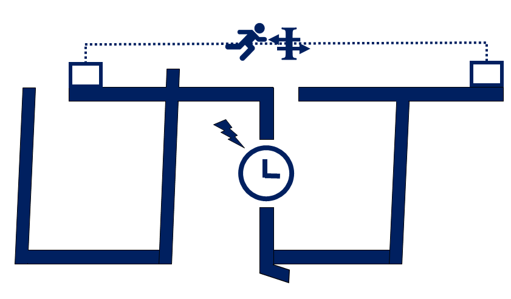
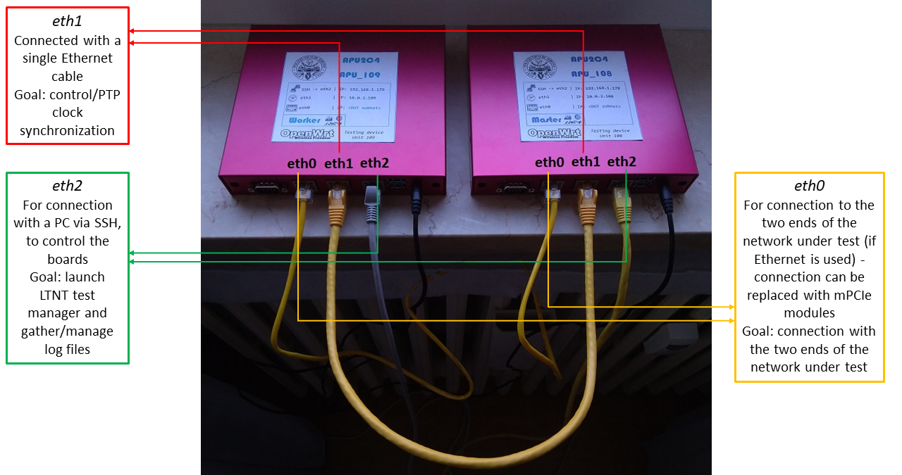

# What is LTNT?

LTNT ("Long Term Network Tester") is a customizable, open source, and cost-effective software and hardware platform for the execution of network measurements, especially focused on long-term measurements and monitoring.
The platform is able to measure the following metrics, in a continuous loop, alternating between throughput and latency/network reliability tests:
- latency (unidirectional, in both directions, and RTT) over UDP
- packet loss
- duplicate packet count
- out of order count
- all the other metrics supported by [LaTe](https://github.com/francescoraves483/LaMP_LaTe)
- throughput (in both directions), over TCP and UDP

**Important:** this project is still in a very early stage. You are really welcome if you want to contribute and provide suggestions! More features and configuration parameters are going to be added in the future.

# LTNT open source software

The platform software is relying on the following elements, which should be installed all together in order to perform countinuos network measurements:
- [iPerf](https://iperf.fr/) 2.0.13+ (also versions with a lower subversion number should work fine. However, the system has been tested with version 2.0.13 or greater) - used for the throughput measurements
- [LaTe](https://github.com/francescoraves483/LaMP_LaTe/tree/development) 0.1.7-beta-development 20201105a or greater (the [development branch](https://github.com/francescoraves483/LaMP_LaTe/tree/development) shall be used for the time being, as the platform requires the `--initial-timeout` option, which is not yet available in version 0.1.6-beta, on the master branch) - used for measuring all the other metrics
- the LTNT test manager program, the core of LTNT, acting as a lightweight orchestrating software to launch and manage the lifecycle of different instances of iPerf and LaTe during the execution of the tests. **This repository is hosting the LTNT test manager program, plus some other useful files.**
- a package in order to perform the clock synchronization between the involved devices, in which iPerf, LaTe and LTNT test manager are going to run (suggested package for PTP clock synchronization: `linuxptp` - or `ptpd`, when not using the suggested hadware boards)

# LTNT customizable hardware and required minimum specifications

In order to perform the measurements, the open source software mentioned above can potentially run on any compatible device, provided that it is respecting the following minimum requirements:
- Two (possibly equal) Linux devices are needed and should be attached at the two ends of the network at which the user is interested to measure the aforementioned metrics. At least Linux kernel version 4.14 is recommended.
- Both the devices should have a dedicated Ethernet port, which is used by LTNT test manager to send/receive control data and to synchronize the execution of the tests between these devices. This dedicated port should be *dedicated* and not used to connect the devices to the network under test. The two dedicated ports should be connected, if possible, with a point-to-point connection, i.e. with a single Ethernet cable (Gigabit Ethernet is better than 100 Mbit Ethernet).
These ports/interfaces should also be used to precisely sinchronize the clocks of the two devices (by using `linuxptp` or any other clock synchronization package). Any failure in providing the clock synchronization will result in inaccurate unidirectional latency measurements (while all the other measurements should be unaffected).
We highly recommend, for this purpose, Ethernet NICs supporting the PTP (IEEE 1588) Hardware Clock synchronization, like Intel i210-T1, i210AT/i211AT, i219-V.
- The devices should be connected to the network under test (either through Ethernet, or through 802.11, or through any other interface different than the dedicated one mentioned before) and should be **reachable in both directions via IPv4**. **The user may need to configure port forwarding if a device performing a NAT is placed in between.**

However, the **official LTNT platform** is composed by a **specific hardware**, which has been extensively tested and which proved to be ideal for the purpose of performing network measurements, on which the software mentioned before should be integrated.

The hardware is composed by two [APU2x4 embedded boards](https://www.pcengines.ch/apu2.htm) (we tested the system with APU2C4, but any APU2 board should be fine, including APU2B4, APU2D4 and APU2E4), with the following characteristics and configuration:
- The boards are already equipped with PTP-compatible Ethernet cards. The connectivity to the network under test can be extended with any compatible mPCIe card (such as Compex WLE600VX for 802.11, or Sierra Wireless AirPrime MC7304 for LTE).
- An Ethernet port (**the same one on both boards!**) should be reserved on the two boards for the control/clock synchronization connection. These two Ethernet ports should be connected via a point-to-point connection (i.e. a single Ethernet cable).
- Out of the two other ports, in both boards, one should be reserved for connecting a PC to the boards via SSH (in order to control them), without "disturbing" neither the measurements nor the control/clock synchronization connecton.
- The two boards should be connected to the two endpoints of interest, in the network under test, either by relying on the third free Ethernet port, or by using Wi-Fi/cellular connectivity thanks to mPCIe modules installed on the hardware.
- The suggested Ethernet port configuration and connection (which also corresponds to the default configuration values in LTNT test manager) is depicted below:


As operating system, we selected OpenWrt (version 19.07+), as it proved to be a robust and effective Linux OS for networking applications.
Thus, the **full LTNT platform** is composed by:
- The two APU2x4 boards, connected following the guidelines described before
- OpenWrt 19.07+
- The linuxptp package for the PTP clock synchronization
- LaTe, iPerf 2 and LTNT test manager installed into OpenWrt

To resume, in order to perform the network measurements, the user can rely on:
- The _full LTNT platform_ (software + PC Engines hardware + OpenWrt), which is the suggested and tested option - the **steps** described below refer to the **full LTNT platform**
- Only the _LTNT software components_ (iPerf, LaTe, a clock synchronization package, LTNT test manager), with other devices respecting the minimum requirements and configuration mentioned above and running a Linux OS - the user, in this case, will have to properly configure these devices, taking as reference the steps described below (however, the same steps may change significantly depending on the hardware configuration and, especially, on the selected OS; for instance, if you decide to use two Ubuntu PCs, you do not need to prepare another OS, like OpenWrt, and flash it somewhere and you do not need to cross-compile anything, as you can directly compile both _LTNT_test_manager_ and _LaTe_)

# How does LTNT work?

LTNT relies on a master-slave paradigm. One hardware device acts as **master**, and it is directly controlled by the user, for instance for starting a measurement session.
The *LTNT test manager* instance on the master can be configured with an INI configuration file (**LTNT.ini**).

The other hardware device acts instead as **slave**. On the slave the *LTNT test manager* should be installed as a *service*, and be always ready to accept connections from the master.
It is then completely controlled by the master (its configuration parameters are also received from the master and no INI file is used) and the user only needs to access it, for the time being, to collect the CSV logs after a measurement session.

After a measurement session, the LTLT software will output a series of CSV files containing all the measured metrics.

These files will be saved inside the folders specified in the LTNT.ini configuration file of the master (the same folder names and paths will be then used in the slave file system).

# Steps for preparing and installing the platform
## The case with Ethernet connection to the two ends of the network under test and the usage of the full LTNT platform is considered

* Get two APU2x4 boards, and choose the device which will become the master, and the one which will become the slave.
* We will now download and install OpenWrt in the two boards.
* Clone the git repository of OpenWrt on a Linux PC (e.g. running Ubuntu 20.04 LTS):
```
git clone https://git.openwrt.org/openwrt/openwrt.git
cd openwrt
```
* Checkout a stable release (for example, the latest at the time of writing, i.e. v19.07.4):
```
git checkout v19.07.4
```
* Update and install the feeds:
```
./scripts/feeds update -a
./scripts/feeds install -a
```
* _(Optional step)_ In order to make the package selection operation faster (which will be performed a few steps after the current one), you can use an already available OpenWrt build system configuration file.
This file may not already select all the packages listed below, but it should include at least most of them and all the foundamental ones.
The file is located inside "OpenWrt_build_config_file", in this repository, and it is called "config-2020-07-13a". It should be renamed to ".config" and copied to the `openwrt` directory created with the `git clone` operation, replacing the existing hidden file.
* Run "make menuconfig" and select the **x86_64** target, then set a default config:
```
make menuconfig
make defconfig
```
* Run "make kernel_menuconfig" and select "**Processor type and features->Preemption Model->Preemptible Kernel (Low-Latency Desktop)**". This will make the kernel preemptible, allowing system calls to be pre-empted by the CPU scheduler and ensuring a more reactive low-latency execution, to more precisely evaluate the latency metrics. **The usage of a low-latency kernel is also suggested when not using OpenWrt and the APU2x4 boards** (i.e. when not using the full LTNT platform):
```
make kernel_menuconfig
```
* Select the following required and suggested packages with "make menuconfig", if they are not already selected:
```
make menuconfig
```
Packages list:
```
amd64-microcode
base-files
bash
beep
bnx2-firmware
busybox
cgi-io
coreutils
coreutils-basename
coreutils-date
coreutils-nice
coreutils-nohup
coreutils-seq
coreutils-sleep
coreutils-uname
coreutils-whoami
dmesg
dmidecode
dnsmasq
dropbear
e2fsprogs
ethtool
firewall
flashrom
fstools
fstrim
fwtool
getopt
getrandom
grep
htop
ip6tables
iperf
iperf3
iptables
iptables-mod-conntrack-extra
iptables-mod-ipopt
iputils-ping
iputils-ping6
irqbalance
iw-full
jshn
jsonfilter
kernel
kmod-asn1-decoder
kmod-bnx2
kmod-button-hotplug
kmod-crypto-aead
kmod-crypto-authenc
kmod-crypto-hash
kmod-crypto-hw-ccp
kmod-crypto-manager
kmod-crypto-null
kmod-crypto-pcompress
kmod-crypto-rsa
kmod-crypto-sha1
kmod-crypto-sha256
kmod-e1000
kmod-e1000e
kmod-gpio-nct5104d
kmod-hwmon-core
kmod-i2c-algo-bit
kmod-i2c-core
kmod-ifb
kmod-igb
kmod-input-core
kmod-ip6tables
kmod-ipt-conntrack
kmod-ipt-conntrack-extra
kmod-ipt-core
kmod-ipt-ipopt
kmod-ipt-nat
kmod-ipt-offload
kmod-ipt-raw
kmod-leds-apu2
kmod-leds-gpio
kmod-lib-crc-ccitt
kmod-libphy
kmod-mii
kmod-nf-conntrack
kmod-nf-conntrack6
kmod-nf-flow
kmod-nf-ipt
kmod-nf-ipt6
kmod-nf-nat
kmod-nf-reject
kmod-nf-reject6
kmod-nls-base
kmod-pcspkr
kmod-ppp
kmod-pppoe
kmod-pppox
kmod-pps
kmod-ptp
kmod-r8169
kmod-random-core
kmod-sched-connmark
kmod-sched-core
kmod-slhc
kmod-sound-core
kmod-sp5100_tco
kmod-usb-core
kmod-usb-ehci
kmod-usb-net
kmod-usb-net-asix
kmod-usb-net-asix-ax88179
kmod-usb-net-cdc-ether
kmod-usb-net-ipheth
kmod-usb-net-rndis
kmod-usb-net-rtl8150
kmod-usb-net-rtl8152
kmod-usb-ohci
kmod-usb-uhci
kmod-usb2
kmod-usb3
libblkid1
libblobmsg-json
libc
libcomerr0
libelf1
libext2fs2
libf2fs6
libftdi1
libgcc1
libimobiledevice
libip4tc2
libip6tc2
libiwinfo-lua
libiwinfo20181126
libjson-c2
libjson-script
libkmod
liblua5.1.5
liblucihttp-lua
liblucihttp0
libmount1
libncurses6
libnl-tiny
libopenssl1.1
libpcap1
libpci
libpcre
libplist
libpthread
libreadline8
librt
libsmartcols1
libss2
libubox20191228
libubus-lua
libubus20191227
libuci20130104
libuclient20160123
libusb-1.0-0
libusb-compat4
libusbmuxd
libuuid1
libxml2
libxtables12
linuxptp
logd
lua
luci
luci-app-firewall
luci-app-opkg
luci-app-qos
luci-base
luci-compat
luci-lib-ip
luci-lib-jsonc
luci-lib-nixio
luci-mod-admin-full
luci-mod-network
luci-mod-status
luci-mod-system
luci-proto-ipv6
luci-proto-ppp
luci-theme-bootstrap
mkf2fs
mtd
nano
netcat
netifd
odhcp6c
odhcpd-ipv6only
openssh-client
openwrt-keyring
opkg
partx-utils
pciutils
ppp
ppp-mod-pppoe
procd
procps-ng
procps-ng-watch
qos-scripts
r8169-firmware
rpcd
rpcd-mod-file
rpcd-mod-iwinfo
rpcd-mod-luci
rpcd-mod-rrdns
tc
tcpdump
terminfo
ubox
ubus
ubusd
uci
uclibcxx
uclient-fetch
uhttpd
urandom-seed
urngd
usbmuxd
usbutils
usign
zlib
```
* Download all dependency source files before performing the build operation with "make":
```
make download
```
* Build the OpenWrt image (the build command for a multi-core verbose compilation is shown, using a quad-core eigth-thread Intel Core i7 CPU)
```
make -j10 V=s
```
* Please note that the build process may take up to several hours, depeding on the development PC characteristics; you will find the compiled OpenWrt images inside "/bin/targets/x86/64/"
* Configure then the OpenWrt toolchain for cross-compiling the needed software (_LaTe_ and _LTNT test manager_) for the target embedded boards. The instructions can be found [here](https://openwrt.org/docs/guide-developer/crosscompile). The first four points should be sufficient to enable cross-compilation, in our case.
* After creating the OpenWrt image, flash it into both boards. Instructions on how to do so can be found in [this document](https://webthesis.biblio.polito.it/9525/1/tesi.pdf), in section 5.3 (starting from page 172). The instructions are related to the APU1D devices, but they are the same also for the APU2 boards.

Once the system has been downloaded/flashed into the target embedded board and after rebooting it at least once, do the following operations (**on both the master and the slave board**):
* Connect a serial cable to the board and to your development PC and open a new connection with baud rate 115200
* Edit the "/etc/config/network" configuration file:
```
vi /etc/config/network
```
* Locate the configuration block for the SSH Ethernet interface (normally the interface is called `lan` in the configuration file). Comment out the lines referring to 'bridge' and 'ip6assign' adding a `#` in front of them
* If more than one Ethernet interface is listed after `option ifname`, edit this line and make sure only the interface you want to use for SSH is specified (suggested interface: `eth2`):
```
option ifname 'eth2'
```
* Choose an IP address, belonging to a proper subnet, for the Ethernet port: this is the address that you will need to specify when connecting to the board with a development PC, using SSH (remember to use two different IP addresses for the master and slave boards!):
```
option ipaddr '192.168.1.178'
```
* Reboot the board:
```
reboot
```

You can now disconnect the serial cable and **connect via SSH to the boards for the next configuration steps** (using, as username, "root").
**Unless stated otherwise**, the following operations should be repeated for **both the master and the slave board**.

* Edit the "/etc/config/network" configuration file (`nano /etc/config/network`), by replacing/integrating the actual content and using as a model the following one (the original file can also be found inside 'Slave/Master_files/openwrt_config/etc/config' in this repository):
```
config interface 'loopback'
        option ifname 'lo'
        option proto 'static'
        option ipaddr '127.0.0.1'
        option netmask '255.0.0.0'

config globals 'globals'
        option ula_prefix 'fd77:5157:bdcb::/48'

config interface 'lan'
#       option type 'bridge'
        option ifname 'eth2'
        option proto 'static'
        option ipaddr '10.0.1.108'
        option netmask '255.255.255.0'
#       option gateway '10.0.1.1'
#       option ip6assign '60'

config interface 'ptplan'
        option ifname 'eth1'
        option proto 'static'
        option ipaddr '10.0.2.108'
        option netmask '255.255.255.0'

config interface 'lte'
        option ifname 'usb0'
        option proto 'dhcp'

config interface 'dut'
        option ifname 'eth0'
        option proto 'static'
        option ipaddr '172.22.47.250'
        option gateway '172.22.47.254'
        option netmask '255.255.255.248'
```
In the `lan` block, you should insert the IP address, netmask and interface name for the SSH Ethernet interface (`eth2` when using the suggested connections, as described before).

In the `ptplan` block, you should insert the IP address, netmask and interface name for the control/clock synchronization Ethernet interface (`eth1` when using the suggested connections, as described before). The two boards must have an IPv4 address belonging to the same subnet.

In the `dut` block, you should insert the IP address, netmask, interface name and, if needed, default gateway for the Ethernet interface connected to the corresponding endpoint of the network under test (if Ethernet is used to connect to the network under test).

The `lte` interface is an optional interface which can be used to connect to a smartphone via USB thethering. In this case the connection to the network under test will be performed via the smartphone (thanks to USB), instead of Ethernet or other media via mPCIe modules.
This interface can be configured to receive an IP address/default gateway through DHCP, as in this case, or it can also be configured with a static IP address. The supported OpenWrt network configuration options are listed [here](https://openwrt.org/docs/guide-user/base-system/basic-networking).
* Disable NTP, to avoid any undesired clock step during the tests, if the boards are connected to the Internet. This can be done by editing "/etc/config/system" and setting:
```
option enabled '0'
option enable_server '0'
```
After:
```
config timeserver 'ntp'
```
* Edit the "/etc/rc.local" file of both boards (this file will contain a series of commands to be executed at startup in order to guarantee the clock synchronization via the `ptplan` interface), inserting the following content (the rc.local files for the master and slave boards can also be found inside 'Slave/Master_files/openwrt_config/etc' in this repository).
If you use another interface for the clock synchronization/control operations other than the suggested one (i.e. `eth1`), you need to replace `ptp1`, in the scripts below, with the proper PTP device of the chosen interface (other than replacing the interface name after `ptp4l -i`). Typically, `ptp1` corresponds to `eth1`, `ptp0` to `eth0` and `ptp2` to `eth2`.

**Master board:**
```
ptp4l -i eth1 -m --use_syslog=0 > /root/ptp4l.log &

beep -f 500
phc2sys -s /dev/ptp1 -w -m -S 1 > /root/phc2sys_initial.log &

while true; do
	if [ $(cat /root/phc2sys_initial.log | wc -l) -gt 0 ]; then
		break
	fi
	sleep 1
done
	
while true; do
	cat /root/phc2sys_initial.log | tail -1 | grep "Waiting for ptp4l" >/dev/null 2>&1
	if [ $? -ne 0 ]; then
		break
	fi
	sleep 1
done

sleep 5
killall -9 phc2sys

phc2sys -s /dev/ptp1 -w -m --use_syslog=0 > /root/phc2sys.log &
beep -f 200 -l 200
beep -f 700 -l 100 -D 200
beep -f 200 -l 200
beep -f 700 -l 100 -D 200
beep -f 200 -l 200
beep -f 700 -l 100 -D 200
exit 0
```
**Slave board:**
```
ptp4l -i eth1 -m --use_syslog=0 > /root/ptp4l.log &

beep -f 500
phc2sys -s /dev/ptp1 -w -m -S 1 > /root/phc2sys_initial.log &

while true; do
	if [ $(cat /root/phc2sys_initial.log | wc -l) -gt 0 ]; then
		break
	fi
	sleep 1
done
	
while true; do
	cat /root/phc2sys_initial.log | tail -1 | grep "Waiting for ptp4l" >/dev/null 2>&1
	if [ $? -ne 0 ]; then
		break
	fi
	sleep 1
done

sleep 5
killall -9 phc2sys

phc2sys -s /dev/ptp1 -w -m --use_syslog=0 > /root/phc2sys.log &

beep -f 700 -l 200 -D 200
beep -f 700 -l 200 -D 200
beep -f 700 -l 200 -D 200

exit 0
```

* Reboot the boards. After rebooting, you should hear a single "beep" from them when the boot is complete and three consecutive "beeps" when the clock synchronization has been performed.
```
reboot
```

**You can now move to your Linux PC**, where we will download and (cross-)compile the needed software, i.e. **LaTe** and **LTNT test manager**.
First, download LaTe, from GitHub, and compile it:
```
git clone --recursive https://github.com/francescoraves483/LaMP_LaTe.git
git checkout development --recurse-submodules
cd LaMP_LaTe
```
Then, if the OpenWrt toolchain has been properly installed, you should be able to successfully execute:
```
make compileAPU
```
This will produce the LaTe binary file (called `LaTe`), cross-compiled for the APU2 boards (x86_64 platform with *musl* as C standard library). Transfer this file, using for instance SCP, to **both boards, and place it inside `/root`**.

Then, download and compile the LTNT test manager, by cloning this GitHub repository:
```
git clone https://github.com/francescoraves483/LTNT.git
cd LTNT
cd LTNT_Test_Manager
```
After cloning the repository and moving to the right directory, compile the test manager:
```
make compileAPU
```
This will produce the LTNT test manager binary file (called `LTNT_test_manager`). Transfer this file, using for instance SCP, to both the boards, and place it inside `/root/LTNT` (after creating the "/root/LTNT" folder, for instance by executing `cd /root && mkdir LTNT` **inside an active SSH connection with the boards**).

Transfer also the `LTNT.ini` configuration file to the **master board** (**it is required only on the master board**), inside the same folder in which the `LTNT_test_manager` executable is placed.

Remember to launch `chmod +x <executable name>` for both the `LaTe` and `LTNT_test_manager` binary files, after transferring them to the boards (and connecting to the devices via SSH), to enable their execution.

The last step is the configuration of the LTNT test manager as an OpenWrt service on the slave.
Transfer the following files (found inside this repository) **to the slave board**:

- "Slave_files/openwrt_config/etc/config/LTNT_test_manager_slave" to be placed inside "/etc/config"
- "Slave_files/openwrt_config/etc/init.d/LTNT_test_manager_slave" to be placed inside "/etc/init.d"

Then, **after connecting to the slave board via SSH**, enable the execution of the file inside "init.d":
```
chmod +x /etc/init.d/LTNT_test_manager_slave
```
And launch, to enable the service:
```
service LTNT_test_manager_slave enable
service LTNT_test_manager_slave start
```

The service can then be managed, on OpenWrt, with:
1. To make the service start at boot:
```
service LTNT_test_manager_slave enable
```
	
2. To start the service:
```
service LTNT_test_manager_slave start
```
	
3. To stop the service:
```
service LTNT_test_manager_slave stop
```
	
4. To disable service startup at boot:
```
service LTNT_test_manager_slave disable
```
	
5. To see the service output:
```
logread | grep daemon
```
or
```
logread -f | grep daemon
```
to look in real-time at the output of the service

Reboot again the boards. You should now be ready to start testing with LTNT!

# How to launch a test session

In order to launch a new test session, connect to the **master device** (**you do not need to control directly the slave device**), edit the LTNT.ini file with the desired configuration parameters, and launch the LTNT test manager with:
```
./LTNT_test_manager --master
```

If you want to clear all the logs, instead of starting a new test session, you can use:
```
./LTNT_test_manager --master -c
```
This command will ask for multiple confirmations (as clearing the logs is a **destructive action**) and will make the master delete all its log files. Then, the master will automatically connect to the slave, and make also the slave delete all its log files as soon as it becomes available.
After this procedure, the master execution will terminate (while the slave will wait for a new connection from a master, in order to start a new measurement session).

In order to launch a test session and then disconnect from SSH, without terminating the tests, you can use:
```
nohup ./LTNT_test_manager --master &
```
All the output of the LTNT test manager will be saved inside the `nohup.out` file, which can be later analyzed, instead of being printed as standard output.

# LaTe errors

LaTe errors (from *stderr*) are automatically saved in log files (named `late_errors_<test_type>.log`), inside the same folder from which the LTNT test manager is launched.
These files are cleared when calling `./LTNT_test_manager --master -c`. If you want to analyze them, remember to save them together with the logs before performing any "clear" operation.

# Gathering the logs

The logs can be gathered, from **both the master and the slave device**, by means, for instance, of SCP.

The logs are saved inside the folders specified in `LTNT.ini`, which are normally located inside the same folder from which the `LTNT_test_manager` is executed (this behaviour can be changed by editing the `test_log_dir` option in `LTNT.ini`).

# Quick connectivity test script

In the future, it is planned to add, to the _LTNT Test Manager_, the possibility to perform very short tests, just to check if the test interface connectivity, through the whole network under study, is working properly (master->slave, slave->master and master<->slave).

As this feature is not yet available, you can find, inside "Utils", a bash script developed for this purpose.

It should be configured by changing the variable values in the first lines:
```
IP_DATA_REMOTE=172.22.47.249 # IP of the slave board (test interface)
IP_CONTROL_REMOTE=10.0.2.109 # IP of the slave board (control interface)
PORT_BIDIR=46001			 # port_late_bidir in LTNT.ini
PORT_UNIDIR_UL=46002		 # port_late_unidir_UL in LTNT.ini
PORT_UNIDIR_DL=46003         # port_late_unidir_DL in LTNT.ini
INTERFACE="eth0"             # test_interface in LTNT.ini (defaul in LTNT Test Manager: eth0)

MY_IP_DATA=172.22.47.250	 		# my_ip_data in LTNT.ini
MY_IP_CONTROL_REMOTE=10.0.2.108		# my_ip_control in LTNT.ini

UDP_IPERF_PKT_LEN=1400              # UDP_iperf_packet_len in LTNT.ini
TCP_IPERF_BUF_LEN=128K              # TCP_iperf_buf_len in LTNT.ini

SSH_PORT=22					  # SSH port to connect to the slave board via SSH, on the control interface
```
These values should be equal to the corresponding values set in LTNT.ini.

The script should be copied to **/root** in the **master board**. It will then coordinate with the **slave board** via the dedicated control interface, with SSH (instead of using UDP/TCP). The SSH port to be used is specified as `SSH_PORT` (in the great majority of cases, this port should be left equal to `22`, i.e. the default port for SSH).

After transferring the script to the master board, you should (only once) enable its execution with:
```
chmod +x /root/Quick_test_connectivity.sh
```
Then, you can launch it by moving to the /root directory and calling:
```
./Quick_test_connectivity.sh
```

# LTNT.ini configuration options

The tests can be configured with `LTNT.ini`, which is supporting, for the time being, the following options:

- `[IP addresses] ip_data_remote`: IPv4 address to be used to reach the slave board
- `[IP addresses] ip_control_remote`: IPv4 address of the control/clock synchronization interface of the slave board (currently unused, may be removed soon)
- `[IP addresses] my_ip_data`: IPv4 address to be used by the slave board to reach the master board (it may be directly the master board test interface IP or the IP address of a gateway to be used to reach the master board)
- `[IP addresses] my_ip_control`: IPv4 address of the control/clock synchronization interface of the master board (currently unused, may be removed soon)
- `[Ports] port_late_bidir`: UDP port to be used by LaTe to perform the RTT master<->slave tests
- `[Ports] port_late_unidir_UL`: UDP port to be used by LaTe to perform the unidirectional master->slave tests
- `[Ports] port_late_unidir_DL`: UDP port to be used by LaTe to perform the unidirectional slave->master tests
- `[Ports] port_iperf`: UDP/TCP port to be used by iPerf to perform the throughput tests
- `[Interface] test_interface`: name of the test interface, i.e. the one connected to the network under test (default name: `eth0`)  - this setting is applied at the same time to both the master and the slave board, for the time being (this limitation is going to be fixed soon)
- `[Interface] control_interface`: name of the control interface, i.e. the one of the dedicated interface for control data exchange and clock synchronization (default name: `eth1`) - this setting is applied at the same time to both the master and the slave board, for the time being (this limitation is going to be fixed soon)
- `[Duration] test_duration_iperf_sec`: Duration, in seconds, of the iPerf tests; LTNT continuously alternates LaTe (latency/network reliability), iPerf UL (master->slave) and iPerf DL (slave->master) tests and this option refers to the duration of the single iperf UL/DL test. In order to set an overall throughput test duration (UL+DL) of X seconds, this option should be set to X/2. The iPerf protocol is varied between each consecutive throughput UL+DL test phase (i.e. LaTe -> iPerf TCP -> LaTe -> iPerf UDP -> LaTe -> iPerf TCP -> ...).
- `[Duration] test_duration_late_sec`: Duration, in seconds, of the LaTe tests (i.e. of the latency/network reliability measurement phase); the LaTe RTT, UL and DL tests are performed at the same time for a duration equal to `test_duration_late_sec` seconds, involving three different client/server instances of the LaTe tool.
- `[iperf] UDP_iperf_packet_len`: UDP payload length used by iPerf to perform the tests with UDP
- `[iperf] TCP_iperf_buf_len`: TCP socket application buffer size used by iPerf to perform the tests with TCP (size of the application-layer buffer iperf sets when using the write() and recv() system calls)
- `[LaTe] late_min_periodicity`: LaTe normally performs the latency/network reliability tests, within LTNT, by sending packets with an exponential random perdiocity, which is modified every `late_periodicity_batch` packets. This should allow the tests to cope with any periodic behaviour the network may have as far as latency is concerned, avoding any "sampling" issue. This options sets the minimum periodicity, in milliseconds, the packets should be sent at.
- `[LaTe] late_mean_periodicity`: This options sets the mean periodicity (i.e. the mean of the exponential distribution), in milliseconds, the packets should be sent at.
- `[LaTe] late_periodicity_batch`: This options sets the number of packets after which the transmission periodicity should be changed, extracting a new random number with the exponential distribution.
- `[LaTe] late_payload_sizes`: LaTe relies on LaMP, a lightweight latency measurement protocol (with a 24 B header), in order to collect all the desired metrics. LaTe is then configured to encapsulate LaMP, when testing with LTNT, inside UDP. This option can be used to set the payload size to be encapsulated inside LaMP (our protocol is supporting also the possibility to carry any arbitrary payload, up to 65535 B - LaTe however limits this value to 1448 B to avoid fragmentation on Ethernet networks). If more than one value is specified (several values can also be specified, separated with a **comma**), the values will be sequentially and cyclically used for each consecutive latency/network reliability test phase.
- `[LaTe] late_sleep_between_clients_ms`: This option sets how much LTNT will sleep, in milliseconds, before spawning two consecutive clients in the same test phase (in order to "desynchonize" a bit each client/server instance inside the same test phase); it should normally be set to a value different than a multiple of `late_mean_periodicity` and it should be, if possible, very small.
- `[Paths] scripts_dir`: Deprecated and unused - will be removed with the next LTNT update
- `[Paths] test_log_dir`: Path where to create the logs directories, in which all the CSV logs will be saved. The specified path must be terminated with '/', otherwise this option will just be placed as prefix to the `Log directory names`
- `[Log directory names] logs_late_bidir`: name of the directory, inside `test_log_dir`, where the LaTe RTT (master<->slave) CSV logs will be saved - this folder will be filled in only on the **master** board
- `[Log directory names] logs_late_unidir_UL`: name of the directory, inside `test_log_dir`, where the LaTe UL (master->slave) CSV logs will be saved - this folder will be filled in on the **master** board with the cumulative log (i.e. containing average, mininum, maximum latency, total packet loss, standard deviation, ...) and on the **slave** board with the single packet latency/packet error rate till-now CSV logs
- `[Log directory names] logs_late_unidir_DL`: name of the directory, inside `test_log_dir`, where the LaTe DL (slave->master) CSV logs will be saved - this folder will be filled in on the **slave** board with the cumulative log (i.e. containing average, mininum, maximum latency, total packet loss, standard deviation, ...) and on the **master** board with the single packet latency/packet error rate till-now CSV logs
- `[Log directory names] logs_iperf_UL`: name of the directory, inside `test_log_dir`, where the iPerf UL (master->slave) CSV logs will be saved, containing the throughput measurements - this folder will be filled in only on the **slave** board
- `[Log directory names] logs_iperf_DL`: name of the directory, inside `test_log_dir`, where the iPerf DL (slave->master) CSV logs will be saved, containing the throughput measurements - this folder will be filled in only on the **master** board

# External libraries used in this project

The LTNT test manager, in order to parse the INI configuration file, includes the **INIH library by Ben Hoyt**, licensed under the New BSD license: [INIH GitHub repository](https://github.com/benhoyt/inih)